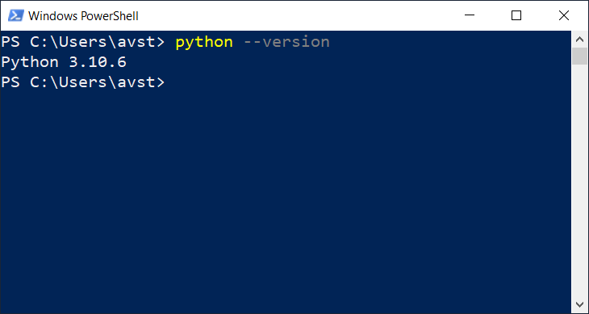

# Overview of key setup steps

- [Install Python](#install-python).
- [Create a virtual environment](#create-a-virtual-environment).
- Install Jupyter Lab.
- Test Jupyter Lab.
- Install some other libraries.
- Install solvers for Pyomo.
- Complete setup of virtual environment.
- Test our environment by running a simple linear program.

## Install Python



## Create a virtual environment

```bash
# Создание виртуального пространства под проект
pipenv --three
```
